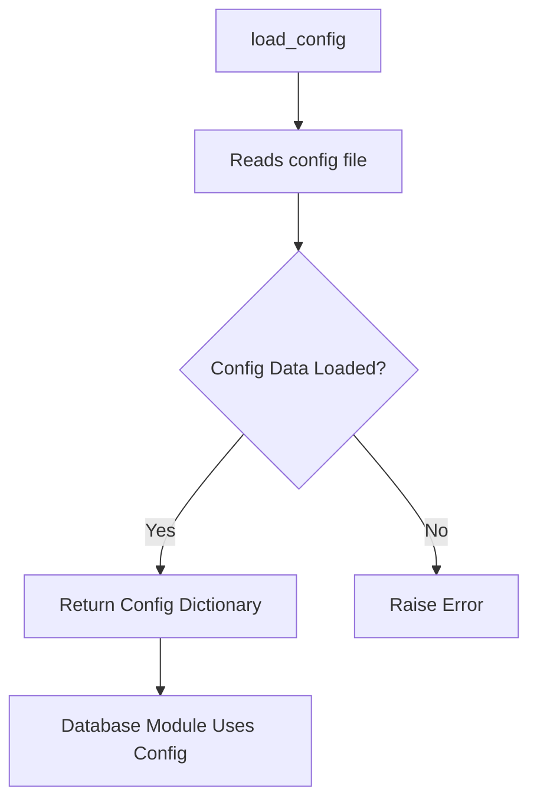

# Configuration Module Documentation (config.py)

## Purpose
The `config.py` module manages database connection settings such as host, port, username, password, and other essential parameters. This module centralizes configuration details, allowing other components of the Database Creation Wizard to access connection settings without hardcoding them in each module.

## Core Functions
1. **`load_config()`**: Reads configuration settings from a file or environment variables and loads them into a Python dictionary for access by other modules.
2. **`save_config()`**: Saves updated configuration settings to a specified file, ensuring that the database connection details are preserved across sessions.
3. **`update_config(param, value)`**: Allows for updating specific parameters (e.g., updating the database name or port) without reloading the entire configuration.

### Function Descriptions
- **load_config(file_path: str) -> dict**:
    - **Purpose**: Loads configuration settings from a specified file.
    - **Parameters**: `file_path` - Path to the configuration file.
    - **Returns**: Dictionary containing connection settings.
    - **Usage Example**:
        ```python
        config = load_config("config.yaml")
        print(config['host'])  # Accessing the host parameter
        ```

- **save_config(config: dict, file_path: str) -> None**:
    - **Purpose**: Saves the provided configuration dictionary to a file.
    - **Parameters**: 
        - `config` - Dictionary of configuration settings.
        - `file_path` - Path to save the updated configuration file.
    - **Usage Example**:
        ```python
        config = {"host": "localhost", "port": "5432", "user": "admin"}
        save_config(config, "config.yaml")
        ```

- **update_config(param: str, value: str) -> None**:
    - **Purpose**: Updates a single configuration parameter and saves it.
    - **Parameters**: 
        - `param` - The specific configuration parameter (e.g., "host").
        - `value` - The new value for the parameter.
    - **Usage Example**:
        ```python
        update_config("database", "new_database")
        ```

## File Format
Configurations are typically saved in a YAML or JSON file format for readability and easy manipulation. Below is an example YAML file structure:

```yaml
host: "localhost"
port: "5432"
database: "my_database"
user: "admin"
password: "securepassword"
```

## Usage
This module is used by various database-related modules such as `connection_manager.py` and `data_ingestion_manager.py` to establish a connection with the PostgreSQL database. Importing `config.py` allows these modules to call `load_config()` and retrieve connection details.

## Error Handling
- **File Not Found**: If the configuration file is missing, `load_config()` will raise a `FileNotFoundError` with a message to specify the missing file.
- **Invalid Format**: If the file content is improperly formatted (e.g., missing keys), the module raises a `ValueError`, ensuring the user receives feedback.

## Dependencies
- **Standard Libraries**: `os` and `yaml` are used to access environment variables and parse YAML files.
- **Other Modules**: This module does not have dependencies on other project modules but is essential for modules that require connection details.

## Diagram: Configuration Access Flow



## Example Usage in Database Modules
1. **Connection Manager**:
    ```python
    from config import load_config

    config = load_config("config.yaml")
    conn = psycopg2.connect(
        host=config["host"],
        port=config["port"],
        database=config["database"],
        user=config["user"],
        password=config["password"]
    )
    ```

2. **Update a Specific Configuration**:
    ```python
    from config import update_config
    update_config("host", "new_host")
    ```

For further details on connection settings, refer to the PostgreSQL documentation.
