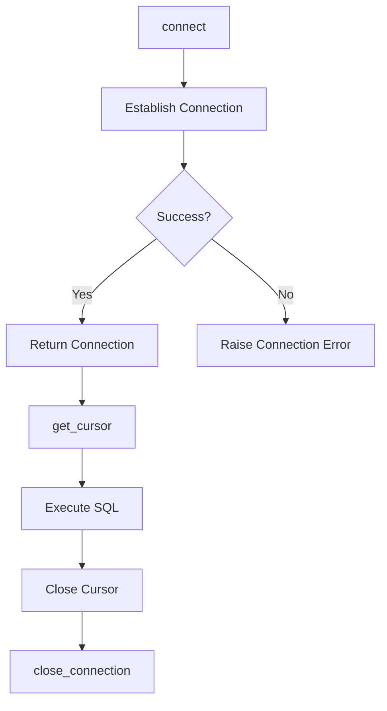

# Connection Manager Documentation (connection_manager.py)

## Purpose
The `connection_manager.py` module provides essential functionality for establishing and managing connections to the PostgreSQL database. This module encapsulates the connection logic, offering reusable methods for connecting to and disconnecting from the database.

## Core Functions
1. **`connect()`**: Establishes a connection to the PostgreSQL database.
2. **`get_cursor()`**: Returns a cursor object for executing SQL commands, using a context manager to ensure the cursor is properly closed after use.
3. **`close_connection()`**: Closes the database connection, releasing resources.

### Function Descriptions
- **connect()**:
    - **Purpose**: Initiates a connection using credentials provided by `config.py`.
    - **Usage Example**:
        ```python
        from connection_manager import ConnectionManager
        conn_manager = ConnectionManager()
        conn_manager.connect()
        ```

- **get_cursor()**:
    - **Purpose**: Provides a context-managed cursor for safe execution of SQL commands.
    - **Usage Example**:
        ```python
        with conn_manager.get_cursor() as cursor:
            cursor.execute("SELECT * FROM my_table;")
            results = cursor.fetchall()
        ```

- **close_connection()**:
    - **Purpose**: Closes the active database connection.
    - **Usage Example**:
        ```python
        conn_manager.close_connection()
        ```

## Error Handling
- **Connection Error**: If the database connection fails, `connect()` raises a `psycopg2.OperationalError`, with details about the failure.
- **Transaction Management**: If an error occurs during a transaction, the module will perform a rollback to ensure data integrity.

## Dependencies
- **`config.py`**: This module uses `load_config()` from `config.py` to retrieve database credentials.
- **`psycopg2`**: The PostgreSQL database adapter used for managing database connections and transactions.

## Example Usage
```python
from connection_manager import ConnectionManager

conn_manager = ConnectionManager()
conn_manager.connect()

with conn_manager.get_cursor() as cursor:
    cursor.execute("CREATE TABLE IF NOT EXISTS test_table (id SERIAL PRIMARY KEY, name VARCHAR(50));")

conn_manager.close_connection()
```

## Diagram: Connection Flow



Refer to `config_module.md` for details on loading database credentials.
