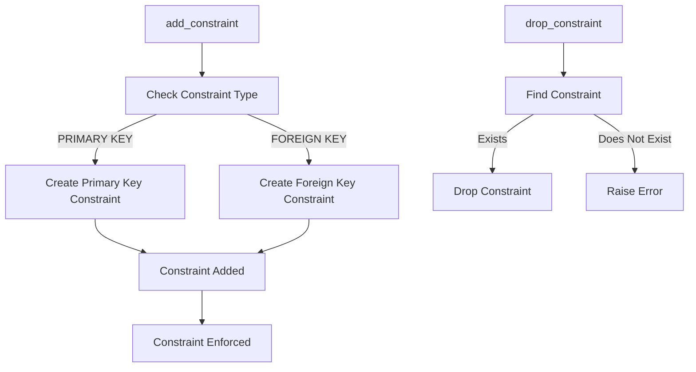

# Constraint Manager Documentation (constraint_manager.py)

## Purpose
The `constraint_manager.py` module is responsible for managing constraints on database tables. Constraints ensure data integrity and enforce rules on data within the database, such as primary keys, foreign keys, and unique constraints.

## Core Functions
1. **`add_constraint(table_name: str, constraint_name: str, constraint_type: str, columns: list, reference_table: str = None, reference_columns: list = None)`**: Adds a constraint (e.g., primary key, foreign key) to the specified table and columns.
2. **`drop_constraint(table_name: str, constraint_name: str)`**: Removes a specified constraint from a table.

### Function Descriptions
- **add_constraint(table_name: str, constraint_name: str, constraint_type: str, columns: list, reference_table: str = None, reference_columns: list = None)**:
    - **Purpose**: Adds a specified constraint type to a table.
    - **Parameters**:
        - `table_name`: Name of the table where the constraint will be added.
        - `constraint_name`: Name of the constraint.
        - `constraint_type`: Type of constraint (e.g., PRIMARY KEY, FOREIGN KEY, UNIQUE).
        - `columns`: List of columns the constraint applies to.
        - `reference_table` and `reference_columns`: (For foreign keys) The table and columns that the foreign key references.
    - **Usage Example**:
        ```python
        from constraint_manager import ConstraintManager
        constraint_manager = ConstraintManager()
        constraint_manager.add_constraint("my_table", "pk_my_table", "PRIMARY KEY", ["id"])
        constraint_manager.add_constraint("my_table", "fk_my_table", "FOREIGN KEY", ["user_id"], "users", ["id"])
        ```

- **drop_constraint(table_name: str, constraint_name: str)**:
    - **Purpose**: Removes an existing constraint.
    - **Parameters**:
        - `table_name`: Name of the table with the constraint.
        - `constraint_name`: Name of the constraint to drop.
    - **Usage Example**:
        ```python
        constraint_manager.drop_constraint("my_table", "fk_my_table")
        ```

## Error Handling
- **Constraint Exists**: Attempting to add a constraint that already exists raises an error.
- **Missing Constraint**: Dropping a non-existent constraint raises an error, which the module handles gracefully.

## Dependencies
- **`connection_manager.py`**: Provides the database connection for executing constraint-related queries.
- **`table_manager.py`**: Manages table structures, enabling constraint application.

## Example Usage
```python
from constraint_manager import ConstraintManager

# Add primary key constraint
constraint_manager = ConstraintManager()
constraint_manager.add_constraint("test_schema.test_table", "pk_test_table", "PRIMARY KEY", ["id"])

# Drop primary key constraint
constraint_manager.drop_constraint("test_schema.test_table", "pk_test_table")
```

## Diagram: Constraint Addition and Deletion Flow



Refer to `table_manager.md` for details on table setup.
