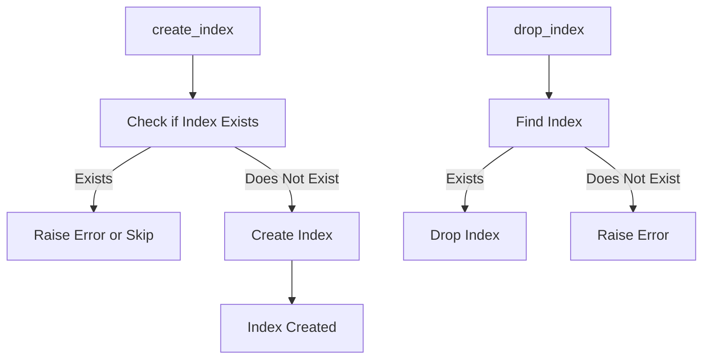

# Index Manager Documentation (index_manager.py)

## Purpose
The `index_manager.py` module provides functions to create and delete indexes on database tables. Indexes are essential for optimizing query performance by enabling faster data retrieval. This module enables users to create various types of indexes to suit specific query patterns.

## Core Functions
1. **`create_index(index_name: str, table_name: str, column_names: list, unique: bool = False)`**: Creates an index on the specified columns in a table.
2. **`drop_index(index_name: str)`**: Drops an index by its name.

### Function Descriptions
- **create_index(index_name: str, table_name: str, column_names: list, unique: bool = False)**:
    - **Purpose**: Defines an index for efficient querying.
    - **Parameters**:
        - `index_name`: Name of the index to create.
        - `table_name`: The fully qualified name of the table (e.g., `schema_name.table_name`).
        - `column_names`: List of columns to include in the index.
        - `unique`: If `True`, creates a unique index that enforces uniqueness on the specified columns.
    - **Usage Example**:
        ```python
        from index_manager import IndexManager
        index_manager = IndexManager()
        index_manager.create_index("my_index", "my_schema.my_table", ["column1", "column2"], unique=True)
        ```

- **drop_index(index_name: str)**:
    - **Purpose**: Deletes an existing index.
    - **Parameters**:
        - `index_name`: Name of the index to drop.
    - **Usage Example**:
        ```python
        index_manager.drop_index("my_index")
        ```

## Error Handling
- **Index Already Exists**: Attempting to create an index with an existing name raises an error.
- **Missing Index**: Attempting to drop a non-existent index results in a handled error.

## Dependencies
- **`connection_manager.py`**: Manages the database connection.
- **`table_manager.py`**: Provides table structure in conjunction with indexing.

## Example Usage
```python
from index_manager import IndexManager

# Create a unique index
index_manager = IndexManager()
index_manager.create_index("unique_idx", "test_schema.test_table", ["id", "email"], unique=True)

# Drop index
index_manager.drop_index("unique_idx")
```

## Diagram: Index Creation and Deletion Flow



Refer to `table_manager.md` for details on table structure and related operations.
