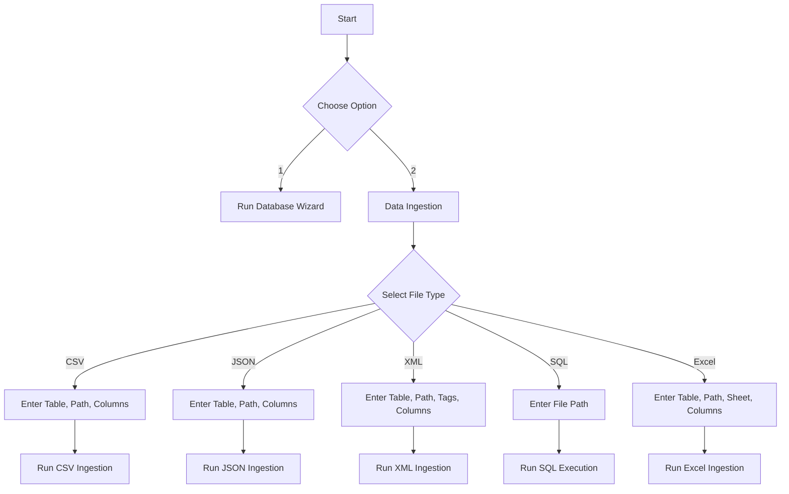

# Main Program Documentation (main.py)

## Purpose
The main entry point of the Database Creation Wizard is `main.py`, which provides an interactive command-line interface (CLI) allowing users to:
1. Run the **Database Creation Wizard** to set up schemas, tables, roles, and other database elements.
2. Execute **Data Ingestion** to populate tables with data from various file formats.

## Structure and Flow
### Primary Functions
- **`run_wizard()`**: Launches the Database Creation Wizard interface, enabling users to create database schemas, tables, and more.
- **`run_data_ingestion()`**: Provides a submenu allowing users to choose file formats (CSV, JSON, XML, etc.) and run data ingestion for selected files.

### CLI Workflow
1. **Initial Prompt**: When run, `main.py` displays the following options:
   - `1`: Run the Database Creation Wizard.
   - `2`: Run Data Ingestion for populating the database with data.
2. **Database Creation Wizard (Option 1)**:
   - Launches `DatabaseCreationWizard` from `database_creation_wizard.py`, guiding users through setting up the database structure.
3. **Data Ingestion (Option 2)**:
   - Prompts the user to select a file format for ingestion.
   - Based on the file type, asks for additional inputs such as file path, table name, and columns.
   - Executes the appropriate ingestion script in `data_ingestion_manager.py`.

### CLI Options and Input Requirements
- **Database Creation Wizard**:
  - No additional inputs are required at this stage; the wizard will guide the user through the setup process.
- **Data Ingestion**:
  - **CSV**: Requires `table_name`, `csv_file_path`, and `columns`.
  - **JSON**: Requires `table_name`, `json_file_path`, and `columns`.
  - **XML**: Requires `table_name`, `xml_file_path`, `columns`, `root_tag`, and `row_tag`.
  - **SQL**: Requires `sql_file_path` only.
  - **Excel**: Requires `table_name`, `excel_file_path`, `sheet_name`, and `columns`.

## Example Usage
### Launch Database Wizard
```bash
python main.py
# Select option 1 for the Database Creation Wizard.
```

### Run Data Ingestion for CSV
```bash
python main.py
# Select option 2 for Data Ingestion.
# Enter "1" for CSV, then follow prompts for table name, file path, and columns.
```

## Workflow Diagram
The diagram below shows the decision flow within `main.py`.



## Error Handling
Each choice and file type ingestion module contains basic error handling. If the user enters invalid options, the program prompts for correction or displays relevant error messages.

## Dependencies
- **Database Creation Wizard Module**: Required to launch the setup wizard.
- **Data Ingestion Manager**: Interfaces with individual ingestion scripts based on file type selection.
- **Standard Libraries**: Utilizes `sys` for command-line arguments, `time` for delay effects, and `unittest` for testing purposes.

Refer to the individual module documentation for more specific details about each functionality.
