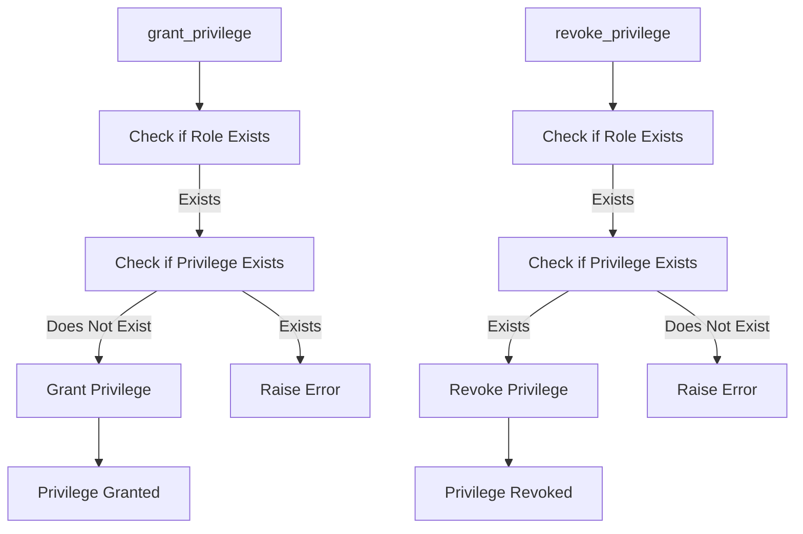

# Privilege Manager Documentation (privilege_manager.py)

## Purpose
The `privilege_manager.py` module manages database privileges, allowing roles to be granted or revoked specific access permissions. This includes privileges such as SELECT, INSERT, UPDATE, and DELETE, enabling fine-grained control over what users can do within each database.

## Core Functions
1. **`grant_privilege(role_name: str, table_name: str, privilege: str)`**: Grants a specified privilege (e.g., SELECT) to a role for a specific table.
2. **`revoke_privilege(role_name: str, table_name: str, privilege: str)`**: Revokes a specified privilege from a role.

### Function Descriptions
- **grant_privilege(role_name: str, table_name: str, privilege: str)**:
    - **Purpose**: Grants a specified privilege to a role for a table.
    - **Parameters**:
        - `role_name`: The name of the role to grant the privilege to.
        - `table_name`: The fully qualified name of the table.
        - `privilege`: The privilege type (e.g., SELECT, INSERT, UPDATE, DELETE).
    - **Usage Example**:
        ```python
        from privilege_manager import PrivilegeManager
        privilege_manager = PrivilegeManager()
        privilege_manager.grant_privilege("read_only_user", "my_schema.my_table", "SELECT")
        ```

- **revoke_privilege(role_name: str, table_name: str, privilege: str)**:
    - **Purpose**: Revokes a specified privilege from a role for a table.
    - **Parameters**:
        - `role_name`: The role to revoke the privilege from.
        - `table_name`: The table where the privilege will be revoked.
        - `privilege`: The privilege type (e.g., SELECT, INSERT).
    - **Usage Example**:
        ```python
        privilege_manager.revoke_privilege("read_only_user", "my_schema.my_table", "SELECT")
        ```

## Error Handling
- **Privilege Exists**: Attempting to grant a privilege that the role already has raises an error.
- **Missing Privilege**: Attempting to revoke a non-existent privilege is handled gracefully.

## Dependencies
- **`connection_manager.py`**: Used to manage the database connection.

## Example Usage
```python
from privilege_manager import PrivilegeManager

# Grant SELECT privilege
privilege_manager = PrivilegeManager()
privilege_manager.grant_privilege("analyst_role", "sales_data", "SELECT")

# Revoke SELECT privilege
privilege_manager.revoke_privilege("analyst_role", "sales_data", "SELECT")
```

## Diagram: Privilege Granting and Revocation Flow



Refer to `role_manager.md` for role management details.
