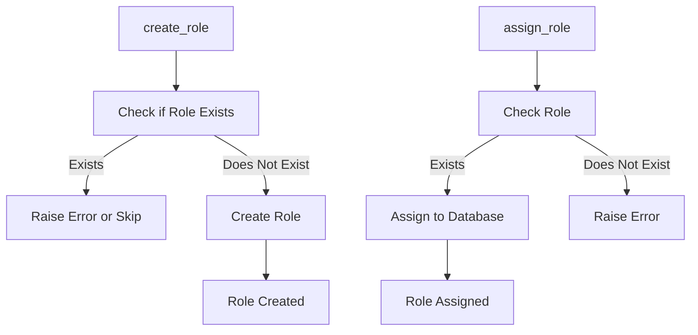

# Role Manager Documentation (role_manager.py)

## Purpose
The `role_manager.py` module handles the management of database roles, which define access permissions and control what users can do within the database. This module provides functions to create roles and assign them to users.

## Core Functions
1. **`create_role(role_name: str, password: str = None, superuser: bool = False)`**: Creates a new role with optional superuser privileges.
2. **`assign_role(role_name: str, database: str)`**: Assigns a role to a specified database, allowing users with the role to access and interact with the database.

### Function Descriptions
- **create_role(role_name: str, password: str = None, superuser: bool = False)**:
    - **Purpose**: Creates a database role with specified permissions.
    - **Parameters**:
        - `role_name`: Name of the role to create.
        - `password`: Optional password for role authentication.
        - `superuser`: If `True`, grants superuser privileges to the role.
    - **Usage Example**:
        ```python
        from role_manager import RoleManager
        role_manager = RoleManager()
        role_manager.create_role("read_only_user", password="securepassword", superuser=False)
        ```

- **assign_role(role_name: str, database: str)**:
    - **Purpose**: Assigns a role to a database, allowing access.
    - **Parameters**:
        - `role_name`: The role to assign.
        - `database`: The database to which the role is granted access.
    - **Usage Example**:
        ```python
        role_manager.assign_role("read_only_user", "test_database")
        ```

## Error Handling
- **Role Exists**: Attempting to create a role that already exists raises an error.
- **Missing Role**: Assigning a non-existent role raises a handled error.

## Dependencies
- **`connection_manager.py`**: Manages the database connection for executing role management queries.
- **`privilege_manager.py`**: Manages additional access privileges that can be granted to roles.

## Example Usage
```python
from role_manager import RoleManager

# Create a new role
role_manager = RoleManager()
role_manager.create_role("data_analyst", password="analystpass", superuser=False)

# Assign the role to a database
role_manager.assign_role("data_analyst", "analytics_db")
```

## Diagram: Role Creation and Assignment Flow



Refer to `privilege_manager.md` for additional role privileges management.
