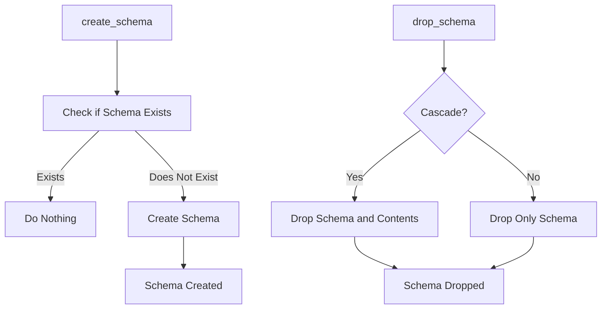

# Schema Creator Documentation (schema_creator.py)

## Purpose
The `schema_creator.py` module handles schema management, providing functions to create and delete schemas within the PostgreSQL database. Schemas allow logical grouping of database tables, offering greater organization and control.

## Core Functions
1. **`create_schema(schema_name: str)`**: Creates a new schema in the database with the given name if it does not already exist.
2. **`drop_schema(schema_name: str, cascade: bool = False)`**: Drops an existing schema. When `cascade` is set to `True`, it removes all objects within the schema.

### Function Descriptions
- **create_schema(schema_name: str)**:
    - **Purpose**: Creates a schema in the database to organize tables and other objects.
    - **Parameters**: `schema_name` - The name of the schema to create.
    - **Usage Example**:
        ```python
        from schema_creator import SchemaCreator
        schema_creator = SchemaCreator()
        schema_creator.create_schema("new_schema")
        ```

- **drop_schema(schema_name: str, cascade: bool = False)**:
    - **Purpose**: Deletes a schema and optionally its contents.
    - **Parameters**:
        - `schema_name`: Name of the schema to delete.
        - `cascade`: When `True`, drops all objects within the schema.
    - **Usage Example**:
        ```python
        schema_creator.drop_schema("new_schema", cascade=True)
        ```

## Error Handling
- **Schema Already Exists**: If a schema with the same name exists, `create_schema()` will handle this gracefully.
- **Missing Schema**: Attempting to drop a non-existent schema raises an error, which is caught and reported.

## Dependencies
- **`connection_manager.py`**: Establishes the connection for executing schema operations.

## Example Usage
```python
from schema_creator import SchemaCreator

schema_creator = SchemaCreator()
schema_creator.create_schema("test_schema")
schema_creator.drop_schema("test_schema", cascade=True)
```

## Diagram: Schema Creation and Deletion Flow



Refer to `connection_manager.md` for details on establishing the database connection.
