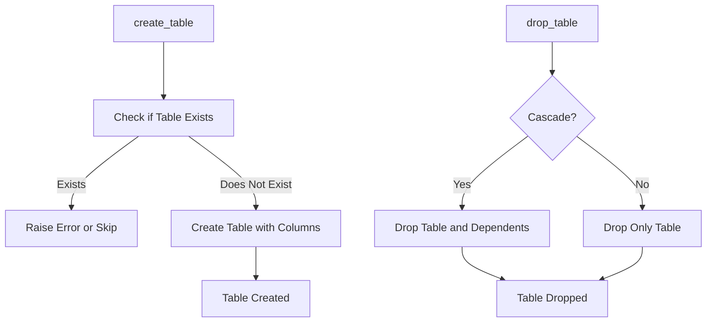

# Table Manager Documentation (table_manager.py)

## Purpose
The `table_manager.py` module provides functionality for creating and deleting tables within a PostgreSQL schema. This module is critical for defining table structures, including column names and data types, within specified schemas.

## Core Functions
1. **`create_table(table_name: str, columns: dict)`**: Creates a table with the specified columns and data types.
2. **`drop_table(table_name: str, cascade: bool = False)`**: Drops an existing table. When `cascade` is `True`, all dependent objects (such as foreign keys) are also dropped.

### Function Descriptions
- **create_table(table_name: str, columns: dict)**:
    - **Purpose**: Defines a new table with columns and data types.
    - **Parameters**:
        - `table_name`: Name of the table to create, including schema (e.g., `schema_name.table_name`).
        - `columns`: Dictionary with column names as keys and data types as values.
    - **Usage Example**:
        ```python
        from table_manager import TableManager
        table_manager = TableManager()
        columns = {"id": "SERIAL PRIMARY KEY", "name": "VARCHAR(100)", "created_at": "TIMESTAMP"}
        table_manager.create_table("my_schema.my_table", columns)
        ```

- **drop_table(table_name: str, cascade: bool = False)**:
    - **Purpose**: Deletes a specified table.
    - **Parameters**:
        - `table_name`: The fully qualified name of the table to drop (e.g., `schema_name.table_name`).
        - `cascade`: If `True`, deletes all dependent objects.
    - **Usage Example**:
        ```python
        table_manager.drop_table("my_schema.my_table", cascade=True)
        ```

## Error Handling
- **Table Already Exists**: Attempting to create a table that already exists raises an error.
- **Missing Table**: Attempting to drop a non-existent table raises an error, which the module handles gracefully.

## Dependencies
- **`connection_manager.py`**: Utilized to establish the database connection.
- **`schema_creator.py`**: Often used together with schema creation to structure the database.

## Example Usage
```python
from table_manager import TableManager

# Define table structure
columns = {
    "id": "SERIAL PRIMARY KEY",
    "name": "VARCHAR(100)",
    "email": "VARCHAR(100) UNIQUE",
    "created_at": "TIMESTAMP DEFAULT CURRENT_TIMESTAMP"
}

# Create table
table_manager = TableManager()
table_manager.create_table("test_schema.test_table", columns)

# Drop table
table_manager.drop_table("test_schema.test_table", cascade=True)
```

## Diagram: Table Creation and Deletion Flow



Refer to `schema_creator.md` for details on creating schemas to organize tables.
