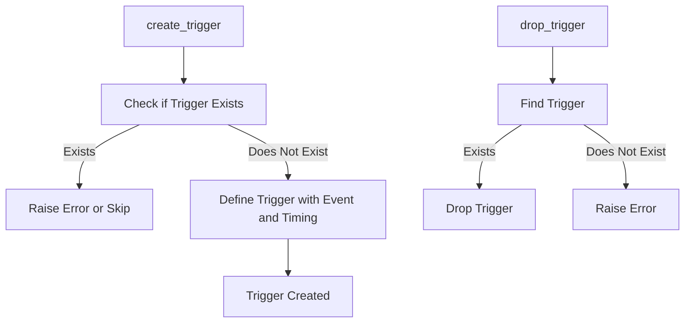

# Trigger Manager Documentation (trigger_manager.py)

## Purpose
The `trigger_manager.py` module provides functionality to create and delete database triggers. Triggers are special procedures executed automatically in response to certain events on a table, such as INSERT, UPDATE, or DELETE, and are essential for enforcing complex business rules at the database level.

## Core Functions
1. **`create_trigger(trigger_name: str, table_name: str, function_name: str, event: str, timing: str)`**: Creates a trigger that executes a specified function upon a defined event (e.g., INSERT) and timing (e.g., BEFORE).
2. **`drop_trigger(trigger_name: str, table_name: str)`**: Deletes an existing trigger.

### Function Descriptions
- **create_trigger(trigger_name: str, table_name: str, function_name: str, event: str, timing: str)**:
    - **Purpose**: Creates a trigger that executes a function based on specified events and timing.
    - **Parameters**:
        - `trigger_name`: Name of the trigger.
        - `table_name`: Table where the trigger is applied.
        - `function_name`: The function that the trigger will execute.
        - `event`: The event that triggers the function (e.g., INSERT, UPDATE).
        - `timing`: The timing of the event (e.g., BEFORE, AFTER).
    - **Usage Example**:
        ```python
        from trigger_manager import TriggerManager
        trigger_manager = TriggerManager()
        trigger_manager.create_trigger("trigger_name", "my_table", "my_function", "INSERT", "BEFORE")
        ```

- **drop_trigger(trigger_name: str, table_name: str)**:
    - **Purpose**: Deletes a trigger from a table.
    - **Parameters**:
        - `trigger_name`: Name of the trigger to delete.
        - `table_name`: Table associated with the trigger.
    - **Usage Example**:
        ```python
        trigger_manager.drop_trigger("trigger_name", "my_table")
        ```

## Error Handling
- **Trigger Exists**: Attempting to create a trigger with an existing name raises an error.
- **Missing Trigger**: Attempting to drop a non-existent trigger raises an error, handled gracefully.

## Dependencies
- **`connection_manager.py`**: Used for executing SQL commands.

## Example Usage
```python
from trigger_manager import TriggerManager

# Create a trigger
trigger_manager = TriggerManager()
trigger_manager.create_trigger("audit_trigger", "user_activity", "audit_function", "INSERT", "AFTER")

# Drop the trigger
trigger_manager.drop_trigger("audit_trigger", "user_activity")
```

## Diagram: Trigger Creation and Deletion Flow



Refer to the PostgreSQL documentation for additional details on trigger functions.
