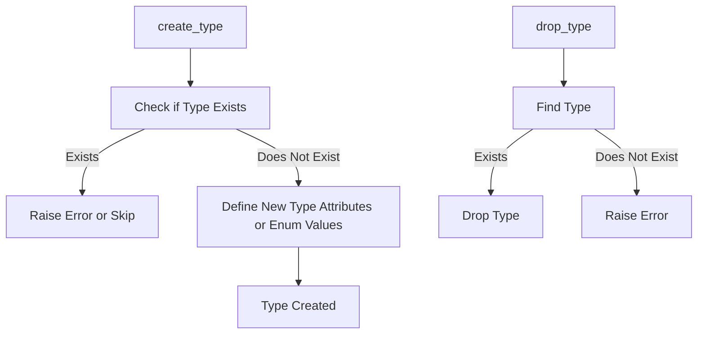

# Type Manager Documentation (type_manager.py)

## Purpose
The `type_manager.py` module provides functionality to create and delete custom data types in PostgreSQL. Custom types allow for more flexible data modeling, such as enums or composite types, which are particularly useful for specific business applications.

## Core Functions
1. **`create_type(type_name: str, type_definition: list)`**: Creates a custom data type with specified attributes or values.
2. **`drop_type(type_name: str)`**: Drops a specified custom data type.

### Function Descriptions
- **create_type(type_name: str, type_definition: list)**:
    - **Purpose**: Defines a new custom data type.
    - **Parameters**:
        - `type_name`: Name of the new data type.
        - `type_definition`: List of attribute names and data types, or enum values.
    - **Usage Example**:
        ```python
        from type_manager import TypeManager
        type_manager = TypeManager()
        type_definition = ["LOW", "MEDIUM", "HIGH"]
        type_manager.create_type("priority_level", type_definition)
        ```

- **drop_type(type_name: str)**:
    - **Purpose**: Deletes an existing custom data type.
    - **Parameters**:
        - `type_name`: Name of the type to drop.
    - **Usage Example**:
        ```python
        type_manager.drop_type("priority_level")
        ```

## Error Handling
- **Type Exists**: Creating a type that already exists raises an error.
- **Missing Type**: Dropping a non-existent type raises a handled error.

## Dependencies
- **`connection_manager.py`**: Manages the database connection for executing type management commands.

## Example Usage
```python
from type_manager import TypeManager

# Create an enum type for priority levels
type_manager = TypeManager()
type_manager.create_type("priority_level", ["LOW", "MEDIUM", "HIGH"])

# Drop the custom type
type_manager.drop_type("priority_level")
```

## Diagram: Type Creation and Deletion Flow



Refer to the PostgreSQL documentation for further details on custom types.
